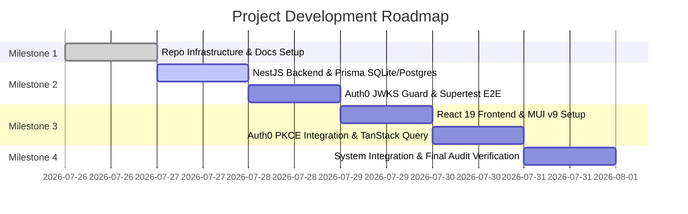

# AI_WORKFLOW.md - AI Agent Collaboration & Project Lifecycle Spec

เอกสารข้อกำหนดกระบวนการทำงานร่วมกับ AI Agent, แผนงานการพัฒนาตาม Milestone, กฎ Pre-commit Guardrails และการบันทึกบทเรียนจากปัญหาในอดีต (Historical Pitfalls & Resolution Strategies) สำหรับโครงการ **Personal Bookmark Manager (Bangkok Bank Candidate Test)**

---

## 🤖 1. กระบวนการทำงานร่วมกับ AI Agent (AI Agent Pair Programming Workflow)

1. **Role Division**:
   - **User (Human Developer)**: ผู้กำหนดความต้องการ (Product & Architecture Requirements), ตรวจสอบแนวทางการออกแบบ และรีวิวโค้ดในทุกขั้นตอน
   - **Lead AI Agent (Antigravity Agent)**: ทำหน้าที่วางแผนการพัฒนา (Planning Mode), เขียนโค้ดหลักทั้ง Backend และ Frontend, จัดทำเอกสาร และดูแลระบบ Audit & Transcripts Logging
   - **Sub-Agents**: รับมอบหมายงานเฉพาะทาง (Specialized Sub-agents) เช่น `transcript-logger` สำหรับบันทึก Log รายวัน และรัน Automated Verification

2. **Strict Protocol for AI Agent Operations**:
   - ทุกครั้งก่อนเริ่มแก้โค้ด ต้องสแกนและตรวจสอบโครงสร้างโปรเจกต์ (Do not guess file paths or schemas)
   - ห้ามลบ แก้ไข หรือทำให้ส่วนของ Test หรือ Code Logic พังโดยการใช้ทางลัด
   - บันทึกการสนทนาทุก Turn ลงในไฟล์ Log รายวันในโฟลเดอร์ `/transcripts` เสมอ

---

## 🗺️ 2. แผนการพัฒนาตาม Milestone (Project Development Milestones)



* **Milestone 1: Repository Infrastructure & Standard Documentation** (Completed)
  - จัดเตรียมโครงสร้าง Monorepo, `README.md`, `AGENTS.md`, `DECISIONS.md`, `API_DESIGN.md`, `AI_WORKFLOW.md` และ `.gitignore`
* **Milestone 2: NestJS Backend & Security Verification**
  - ติดตั้ง NestJS 10+, Prisma ORM (SQLite & PostgreSQL Dual Schemas)
  - สร้าง `AuthGuard` สำหรับตรวจ JWT ด้วย Auth0 JWKS (`jwks-rsa`)
  - พัฒนา Collections & Bookmarks Controllers, Services, DTOs (`class-validator`)
  - รันชุดทดสอบ Supertest E2E สแกน Multi-tenant Isolation
* **Milestone 3: React Frontend & PKCE Authentication**
  - ติดตั้ง React 19+, Vite, MUI v9, React Router v7
  - เชื่อมต่อ Auth0 React SDK ผ่าน PKCE OAuth2 OIDC Flow
  - ติดตั้ง TanStack Query v5 + Axios Interceptor เชื่อมต่อกับ Backend API
* **Milestone 4: End-to-End System Integration & Audit Infrastructure Verification**
  - ตรวจสอบความถูกต้องของการใช้งานจริง การทำงานร่วมกันระหว่าง Frontend และ Backend
  - ทดสอบระบบ Transcript Logger, HTML Transcript Viewer และ Pre-commit Verification Guardrails

---

## 🛡️ 3. ระบบ Pre-commit Guardrails (Husky & lint-staged Integration)

ก่อนทำการ `git commit` ทุกครั้ง ระบบจะรันสคริปต์ตรวจสอบอัตโนมัติผ่าน Husky และ `lint-staged`:

```json
{
  "lint-staged": {
    "*.{js,ts,tsx}": [
      "eslint --fix",
      "prettier --write"
    ],
    "*.{json,md,yml}": [
      "prettier --write"
    ]
  }
}
```

### ขั้นตอนการรัน Pre-commit Verification:
1. **Linting & Formatting**: รัน `npx lint-staged` เพื่อแก้ไขรูปแบบโค้ดอัตโนมัติ
2. **Type Checking**: รัน `npm run type-check` ทั้งฝั่ง Backend และ Frontend
3. **Automated E2E Testing**: รัน `cd backend && npm run test:e2e`
4. **Strict Failure Enforcement**: หากพบ Error ในขั้นตอนใดขั้นตอนหนึ่ง **ห้ามทำการ Commit โดยเด็ดขาด** และ AI Agent ต้องดำเนินการแก้ไขจนผ่าน 100%

---

## ⚠️ 4. บันทึกปัญหาในอดีตและการแก้ไข (Historical Pitfalls & Mitigation Strategies)

| ข้อผิดพลาดที่เคยเกิดขึ้น (Past Pitfall) | สาเหตุที่แท้จริง (Root Cause) | แนวทางการแก้ไขและป้องกัน (Mitigation Strategy) |
| :--- | :--- | :--- |
| **CORS Error บน `file://` ใน HTML Viewer** | เบราว์เซอร์บล็อกการ `fetch()` ไฟล์ `.log` ท้องถิ่นเนื่องจาก Same-Origin Policy | ใช้ Embedded Data Provider ใน `logs-data.js` ผ่านตัวแปร `window.EMBEDDED_TRANSCRIPTS` เพื่อให้โหลดได้โดยไม่ติด CORS |
| **ปัญหา N+1 Query ตอนโหลด Bookmarks** | Frontend ยิง API แยกราย Collection ส่งผลให้ยิง HTTP Requests หลายครั้ง | ออกแบบ Endpoint `GET /collections/all` เพื่อดึง Collections พร้อม Bookmarks ใน Single Query Payload |
| **ข้ามการเช็ค `ownerId` ใน DB Operations** | พัฒนา Query โดยอิงเฉพาะ `id` ของทรัพยากร ทำให้เกิดข้าม Tenant Data Leakage | กำหนดใน Security Invariants บังคับให้ทุก Prisma Query ต้องมี `ownerId` ใน `where` clause เสมอ |
| **Bookmarks หายเมื่อลบ Collection** | ตั้งค่า Foreign Key Cascade Delete (`onDelete: Cascade`) | เปลี่ยนเป็น `onDelete: SetNull` เพื่อย้าย Bookmarks ไปยัง Uncategorized แทนการลบทิ้ง |
| **การแก้ไขปัญหาแบบฉาบฉวย (Superficial Fixes)** | AI Agent ใช้ `eslint-disable`, `@ts-ignore` หรือครอบ `try/catch` 空 | กำหนดใน `AGENTS.md` บังคับให้อ่าน Full Error Log และแก้ไขที่ Code Logic ที่แท้จริงเท่านั้น |
